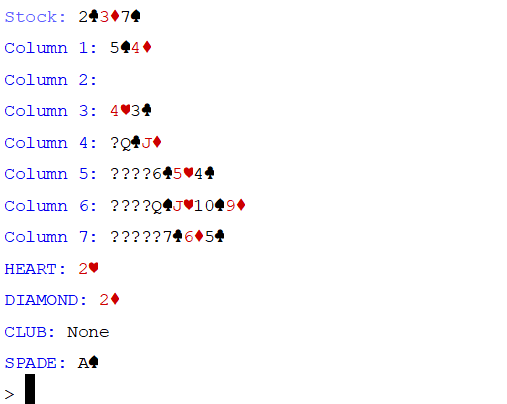

# Kleiner Perkins Fellows Application

This repository contains my Summer 2019 application for the Kleiner Perkins fellowship.  I have chosen to implement a 
version of Solitaire for my supplementary application.

## Solitaire

CLI app for Solitaire, written using Python. 

### Start-up

Within the base directory:
```bash
pip install -e .
solitaire
```

### Gameplay

The image below is an example of the gameplay board.



To see all available commands and pile identifiers, simply type `help`.

### The Piles
- **Stock**: This pile contains the additional cards that have yet to been dealt.  You can see three at a time, but can
only perform action on the top card.  Use `draw` to see the next card in the stock.
- **Columns**: There are seven columns, identified by their ids (from 1 to 7).  To move all visible cards
from one column to another, use `mv x y`, where `x` is the id of the origin pile
and `y` is the id of the target pile.
- **Foundations**: There are four "foundation" piles, one for each suit.
One wins the game by filling all four foundation piles.

### Bugs
To my regret I was not able to start this application early enough, and realized too late that I did not understand the
rules of Solitaire as well as I had imagined.  Thus, this implementation of the gameplay is yet incomplete with the 
following issues that I should seek to resolve upon continuing this implementation:
- The user only has the availability to either move all visible cards off a column, OR move a single card.
The user should ideally be able to move any number of cards from a column to another. 
Although with the current implementation it would be easy to allow the user to specify an index at which all cards
should be moved, it is not ideal from the user experience perspective.
- No point tracking/time tracking was implemented for the game; you either win or you don't.
- No test suites were set up for this game.  

### Discussion and Justification
I chose to implement the game in Python as it is a language that I have had limited experience with and am only now 
using at work.  Since implementing Solitaire is a good way to learn a language, I chose to do this in Python to support
this learning.  Furthermore, as Python is less restricted with its levels of class privacy, it forces one to think 
harder about class structure and best practices with regards to naming conventions, etc.--which is always a good 
challenge to have.

In terms of design, I chose to separate the game into distinct classes for the `Game`, `Stack`, `Deck`, and `Card`.  I
wanted a separation of concerns--especially for UI purposes, each class should be responsible for printing only 
information relative to itself and no other.  As such, `Game` is responsible for only handling user inputs/commands, and 
takes ownership over all `Stack`s present in the game as well as a `Deck` of cards.  The purpose of the `Deck` is mostly
to keep track of `Card`s during the dealing process.  Within `Stack.py`, all `Stack`s are children of an abstract base
class in order to avoid writing duplicate code for certain functionalities.  Each `Stack` should be responsible and have 
unique requirements for when/if a card can be moved off it, and when/it can be moved onto another stack.  Finally, the 
`Card` class is responsible for keeping track of its own information with regards to a card's suit, rank, colour,
visibility to the player, etc.

### Credits
I used the `clint` module to support my development of this project.  View the repo [here](https://github.com/kennethreitz/clint).